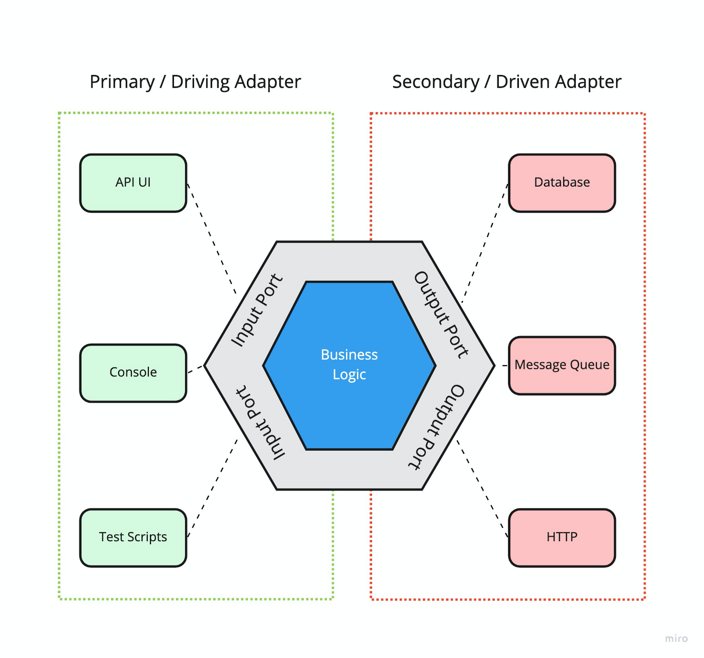
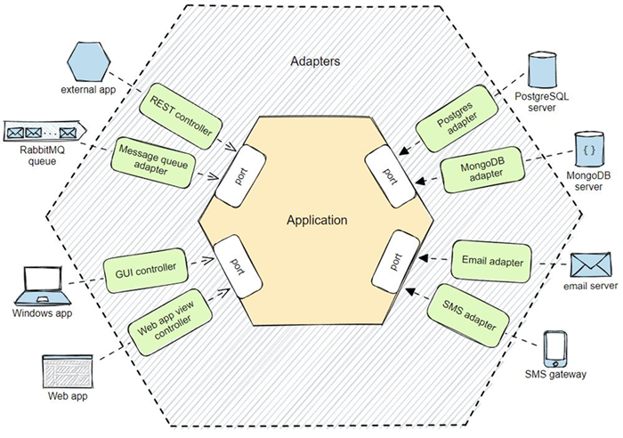

# Hexagonal architecture

## The Pattern: Ports and Adapters (‘’Object Structural’’)

The hexagonal architecture, or ports and adapters, is a structural pattern, also considered as a software design pattern, with which we seek to make an application independent of specific technologies. This allows it to be easily tested, and also to interact with it through different interfaces (API, web application, command line) and to be able to use different technologies for persistence, communications, etc.

When any driver wants to use the application at a port, it sends a request that is converted by an adapter for the specific technology of the driver into an usable procedure call or message, which passes that to the application port. The application is blissfully ignorant of the driver’s technology. When the application has something to send out, it sends it out through a port to an adapter, which creates the appropriate signals needed by the receiving technology (human or automated). The application has a semantically sound interaction with the adapters on all sides of it, without actually knowing the nature of the things on the other side of the adapters.

## Structure



## Architecture Layers

### Domain
The domain layer is the central core of the hexagonal architecture. Its purpose is to contain all the business logic and business rules of the application. This layer should be completely decoupled from any external technology such as databases, web frameworks, external APIs, etc. It is designed to be independent and stable, even when infrastructure details change.

### Application

The application layer coordinates the operations that execute the business logic, acting as an intermediary between the domain layer and the outside world (user interfaces, APIs, databases, etc.). This layer manages the workflow of the application and ensures that the necessary actions are performed in the correct order.

Unlike the domain layer, this layer does not contain the business logic itself, but orchestrates the different pieces (such as domain services, repositories and adapters).

### Infrastructure

In the hexagonal architecture, the infrastructure layer is the part of the system that interacts with external elements, such as databases, web services, file systems, external APIs, and any other system outside the core application domain. This layer is designed to be as decoupled as possible from the core business logic.

--- 


## Folder structure

```md
src
├── application
│   ├── use-cases
│   └── helpers
├── domain
│   ├── entities
│   ├── services
│   ├── helpers
│   └── ports
│       ├── driven-ports
│       └── driving-ports
├── infrastructure
│   ├── adapters
│   |   ├── driven-adapters
│   |   └── driving-adapters
│   └── helpers
├── utils
└── helpers
```

**Definitions:**

- ``application``: The application layer coordinates the operations that execute the business logic, acting as an intermediary between the domain layer and the outside world.
  - ``use-cases``: They are the orchestration of the business logic, responsible for coordinating the interaction between different components of the system, but do not implement the business rules themselves. A use case describes the workflow that must be followed to satisfy an operation.
- ``domain``: This is where the basic business rules live, such as entities, value objects and domain services. Business rules such as 'an order must have at least one item before it can be processed' live here.
  - ``entities``: An entity can be an object with methods, or a group of functions and data structures; they know nothing about external layers and have no dependencies. Encapsulate the general and high-level rules that the application will use.
  - ``services``: Services are classes that encapsulate business logic that does not fit directly within an entity. A service typically operates across multiple Entities and defines processes that are independent of the lifecycle of a particular Entity.
  - ``ports``: Ports are defined using programming language constructs. They are defined at the domain layer and implemented by external adapters.
    - ``driven-ports``: Are interfaces that define the methods to be implemented by the domain use cases. A driven port is a contract that specifies how the application layer (or any other layer that interacts with the domain) may interact with the domain services.
    - ``driving-ports``: Are interfaces that defines the methods that infrastructure adapters should implement. A driving port is a contract that specifies how the domain layer expects to interact with the external infrastructure, such as databases, external services, etc.
- ``infrastructure``: Is the external layer that provides all the necessary details about the frameworks, controllers and tools such as databases, including all the implementations that we use to build the application.
  - ``adapters``: Adapters are concrete implementations of technologies that interface with application ports.
    - ``driven-adapters``: They are the ones that initiate the interaction with the business logic of the application domain.
    - ``driving-adapters``: Implements the driven ports to use the technological solutions that have been decided. It implements the logic necessary to interact with the external infrastructure, such as databases, external services, etc.
- ``utils``: Contain static methods that implement generic and independent operations that are not associated with instances or specific contexts. Often used as a function repository for common use throughout the application.
- ``helpers``: Helping to carry out tasks or specific operations within a larger context. Contain methods that provide additional functionality to classes and components. Often can be used within a class or in a specific module.

---

### Application Notes

**Use Cases And The Application Boundary**

It is useful to use the hexagonal architecture pattern to reinforce the preferred way of writing use cases.

A common mistake is to write use cases to contain intimate knowledge of the technology sitting outside each port. These use cases have earned a justifiably bad name in the industry for being long, hard-to-read, boring, brittle, and expensive to maintain.

Understanding the ports and adapters architecture, we can see that the use cases should generally be written at the application boundary (the inner hexagon), to specify the functions and events supported by the application, regardless of external technology. These use cases are shorter, easier to read, less expensive to maintain, and more stable over time.

**How Many Ports?**

What exactly a port is and isn’t is largely a matter of taste. At the one extreme, every use case could be given its own port, producing hundreds of ports for many applications. Alternatively, one could imagine merging all primary ports and all secondary ports so there are only two ports, a left side and a right side.

Neither extreme appears optimal.

The weather system described in the Known Uses has four natural ports: the weather feed, the administrator, the notified subscribers, the subscriber database. A coffee machine controller has four natural ports: the user, the database containing the recipes and prices, the dispensers, and the coin box. A hospital medication system might have three: one for the nurse, one for the prescription database, and one for the computer-controller medication dispensers.

It doesn’t appear that there is any particular damage in choosing the “wrong” number of ports, so that remains a matter of intuition. My selection tends to favor a small number, two, three or four ports, as described above and in the Known Uses.


