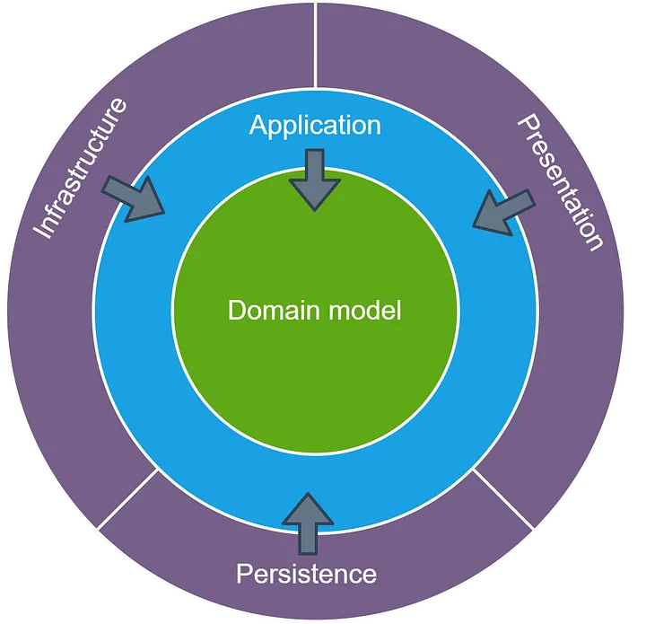

# The Onion Architecture



The main premise is that it controls coupling.  The fundamental rule is that all code can depend on layers more central, but code cannot depend on layers further out from the core.  In other words, all coupling is toward the center.   This architecture is unashamedly biased toward object-oriented programming, and it puts objects before all others.

## Dependency rule

The circles represent different levels of responsibility. In general, the deeper we go, the closer we get to the domain and the business rules. The outer circles represent mechanisms and the inner circles represent the core logic of the domain. The outer layers depend on the inner layers and the inner layers are completely unaware of the outer circles. Classes, methods, variables and source code in general that belong to the outer circle depend on the inner circle, but not vice versa.

The domain (entities and domain services) should not depend on anything external. This ensures that the business rules are completely independent of technical details, which facilitates the maintenance and evolution of the system.

## Layers

### Domain layer:
This is the innermost and most important layer of the onion architecture. It contains the **domain** of the application, i.e. the domain entities and objects that represent the business model and its rules.

It defines the domain objects, the basic business rules and their interactions. This layer must be completely independent of any external technology.

**Domain Services**

This layer contains the **domain services** that do not naturally fit into a single entity, but encompass business logic that affects **multiple entities** or their interactions.

> Defines more advanced business logic that involves coordination between different entities in the domain.

### Application layer:

This layer is where the **use cases** are implemented. It is responsible for coordinating actions between entities and domain services. 

It orchestrates the execution of the **use cases** of the application, such as processing orders, registering users, etc. The **use cases** do not contain business logic per se, but call the domain services and entities to perform the work.

### Infrastructure layer:

It manages external issues such as databases, file systems or external services.

It is the outermost layer of the Onion architecture, containing all the **technical** or infrastructure details. This includes **persistence** (databases), **external APIs**, **messaging** and any other mechanisms that involve interaction with external technologies.

It implements the **adapters** needed to connect the business logic (via interfaces defined in the application layer ports) to the outside world.

### Presentation layer:

It manages the user interfaces and the logic related to the visual presentation of data to users.

---

## Folder structure

```md
src
├── domain
│   ├── entities
│   ├── services
│   └── repositories
├── application
│   └── use-cases
├── infrastructure
│   ├── persistence
│   ├── controllers
│   ├── external
│   │   ├── api-clients
│   │   ├── messaging
│   │   ├── payments
│   │   └── authentication
│   └── helpers
├── helpers
└── utils
```

Definitions: 

- ``domain``: This is where the basic business rules live, such as entities, value objects and domain services. Business rules such as 'an order must have at least one item before it can be processed' live here
  - ``entities``: An entity can be an object with methods, or a group of functions and data structures; they know nothing about external layers and have no dependencies. Encapsulate the general and high-level rules that the application will use.
  - ``services``: Domain services (complex business logic)
  - ``repositories``: Acts as an interface between the domain or application layer and the persistence layer
- ``application``: The application layer coordinates the operations that execute the business logic, acting as an intermediary between the domain layer and the outside world.
  - ``use-cases``: Use cases are the actions that enable the application to meet its functional requirements.
- ``infrastructure``: Is the external layer that provides all the necessary details about the frameworks, controllers and tools such as databases, including all the implementations that we use to build the application.
  - ``persistence``:It is responsible for the administration of all the tools that allow data to be retained, such as databases, file systems, memory management, etc.
  - ``controllers``: Handle user interactions and external requests such as HTTP requests, UI events, etc.
  - ``external``: Specific implementations that allow your application to interact with external systems or third-party services
- ``helpers``: Helping to carry out tasks or specific operations within a larger context. Contain methods that provide additional functionality to classes and components. Often can be used within a class or in a specific module.
- ``utils``: Contain static methods that implement generic and independent operations that are not associated with instances or specific contexts. Often used as a function repository for common use throughout the application.


--- 

## Conclusion

- The Onion architecture Organizes the application into concentric layers, with the domain at the centre.
- The domain layer contains the entities and pure business rules, while the application layer orchestrates the use cases.
- Dependencies flow inwards, ensuring that the business logic does not depend on technical details.
- The infrastructure (databases, APIs, etc.) is in the outermost layers, and interactions are handled through ports and adapters.